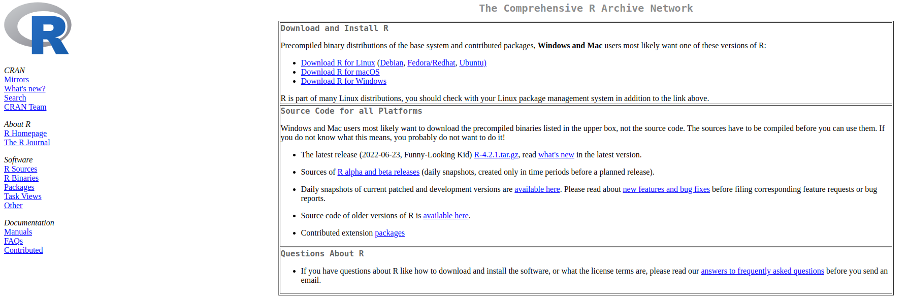
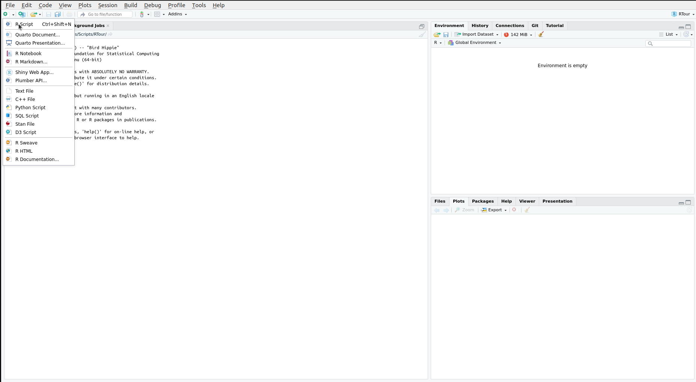

<!-- <script src="https://polyfill.io/v3/polyfill.min.js?features=es6"></script> -->
<!-- <script id="MathJax-script" async src="https://cdn.jsdelivr.net/npm/mathjax@3/es5/tex-mml-chtml.js"></script> -->


# Installing steps

The first steps to get started with [***R***]{style="color: #276dc3ff"} is installing it on your computer. Depending on the version of your OS (*Windows/Linux/MacOS*) you are required to download the right [***R***]{style="color: #276dc3ff"} version.

1. Download the necessary installation files from the [R-project](https://cran.r-project.org/).
{width="400"}
This website will not only allow you to download [***R***]{style="color: #276dc3ff"} but also provide some additional help in case something should go wrong (which it shouldn't so don't worry!).
As a Mac-user you should probably check whether you have an M1 processor or an Intel processor and download the appropriate installation file.

2. Install [***R***]{style="color: #276dc3ff"}!
Once the download is finished you can simply install it as explained under the "download link". Depending on your OS it might look differently.\
*Windows*: click .exe installer\
*Linux*: install via console\
*MacOS*: run the .pkg file using the installer - double click

3. In principle you are done with the minimal requirements. You can check if everything works by running [***R***]{style="color: #276dc3ff"}. Depending on your OS this might look different.\
*Windows*: you will go through the menu and execute [***R***]{style="color: #276dc3ff"}. A bright window will open with a console.\
*Mac*: start as any other app.\
*Linux*: just enter "R" in the terminal.

Once you see the [***R***]{style="color: #276dc3ff"}-console you know it works.

{width="400" right="50%"}

Having installed [***R***]{style="color: #276dc3ff"} we want to use a graphical user interface to have a better time working with it. Also this will allow us to use many more features which might be otherwise more difficult to achieve. So for convenience sake and to get a modern interface we want to install the [***R***]{style="color: #75aadbff"}***Studio*** IDE.

4. Go to [https://posit.co/download/rstudio-desktop/](https://posit.co/download/rstudio-desktop/) and scroll down to see all different available versions. Download the version required by your OS. Again depending on your OS installation might vary:\
*Windows*: Install by start installation by duoble clicking the .exe file.\
*Linux*: Go to the package directory in the terminal and run `sudo dpkg -i rstudio_version_name.deb`.\
*MacOS*: Just drop the .dmg to your application folder. Done!

[***R***]{style="color: #75aadbff"}***Studio*** is THE IDE for [***R***]{style="color: #276dc3ff"} and will make your life a lot easier. Further it is possible to integrate also *Python* and code from other languages (*SQL*, *C++*, *D3*, *Stan*). It is provided by a public-benefit corporation (PBC) which was formerly known as *RStudio* but now is called *Posit* since they offer a large variety of other products besides [***R***]{style="color: #75aadbff"}***Studio***. Using the software for our purposes is 100% free! 

5. Check that you have a working internet connection which does not block the download of [***R***]{style="color: #276dc3ff"} `packages`.

6. You should now be able to see the IDE window.
{width="600" right="50%"}

**Finally**: To be completely prepared for the workshop you can install [***R***]{style="color: #276dc3ff"}-libraries. These are small toolboxes which allow you to perform specific tasks. If you need a library depends on what you want to do and if someone already solved your issue for you (made a library public).

```{r, eval=FALSE}
install.packages("ggplot2", "data.table", "readxl", "patchwork", "ggbeeswarm", "lme4")
```

This command will install 6 libraries which we will use next time. There I will also explain how to find new libraries and how to install them with [***R***]{style="color: #75aadbff"}***Studio***.

Sidenote:
If you are able to have access to our computing server you will also be able to enjoy [***R***]{style="color: #75aadbff"}***Studio*** in the browser <u>on the server</u>. This means you can keep all you data on the server and work without copying or running a software through an additional window.
{width="600"}


